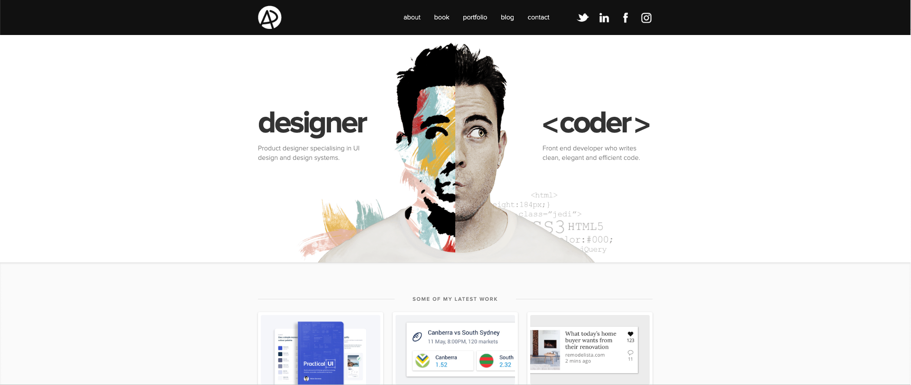

# Marcus Smith's Portfolio

<br>

## Overview

I wanted to create a place to present my professional accreditation as well as to capture memories and projects from my personal life. I used this duality to inform the design of my site, where the user can switch between a more austere header image with professional information to a more playful header that contains personal information.

My other main objective when building the site was to try and test out whether I could build a responsive single page site using HTML, CSS and Javascript only.

<br>
<br>

## Check it out
<a href="www.marcus-smith.net">www.marcus-smith.net</a>

<br>
<br>

## Getting Started
It's a simple website, so no instructions required. Just click the link and have a look around!

<br>
<br>

## Technologies Used
In this project I used the following tools:
 - HTML
 - CSS Bootstrap
 - Javascript

<br>
<br>

## Timeframe & Working Team
This was not issued as a project; rather, a website that I needed and therefore built. I worked on my own over a period of roughly a month. I designed and built the structure for the site in roughly a week, with more time spent populating and writing content - still a bit of a work in progress.

<br>
<br>

## Planning
I knew that I wanted to have a personal website to present my professional skills and projects, and to capture important projects and experiences from my personal life. My objective was to keep both the professional and personal sides of my life accessible, but to demonstrate that they are two distinct parts of me. Doing some research, I took some inspiration from Adham Dannaway's portfolio: 

<a href="https://www.adhamdannaway.com/"></a>

I took inspiration from the way that Adham had connected his two professional expertise within one header image. However, since I needed to display different nav bars according to the selection, I decided to implement my design so that a user can toggle between the personal and professional sides of the site.

With respect to planning, since it was a plain website I didn't need to lay out any kind of ERD, however I did map out the content I wanted to display on paper so I could plan the elements and DOM manipulations.

<br>
<br>


## Build Process
Having built out the content map, I started by building the top (fixed) nav, the professional/personal toggle nav and the header image. Since this toggling functionality was the central objective of the website, I wanted to ensure that I could get that functionality built and tested.

```JavaScript 
professionalToggleSlctEl.addEventListener('click', function() {
    if(toggleEl.checked === false ) {
        toggleEl.checked = true    
    } else if(toggleEl.checked === true ) {
        toggleEl.checked = false    
    }
    handleToggleState()
})

toggleEl.addEventListener('click', function() {
    handleToggleState()
})

personalToggleSlctEl.addEventListener('click', function() {
    if(toggleEl.checked === false ) {
        toggleEl.checked = true    
    } else if(toggleEl.checked === true ) {
        toggleEl.checked = false    
    }
    handleToggleState()
})

function handleToggleState() {
    if(toggleEl.checked === true) {
        resetToPersonalPage()
        personalAboutBtnEl.setAttribute('selected', 'true')
        personalAboutEl.style.display = ''
    } else {
        resetToProfessionalPage()
        professionalAboutBtnEl.setAttribute('selected', 'true')
        professionalAboutEl.style.display = ''
    }
}
```

<br>

Next, I went about building the floating Nav and setting up the HTML structure for the content. Having set up the frame with placeholder text content, I built the DOM manipulation to show/hide the relevant content sections.


```JavaScript 
professionalAboutBtnEl.onclick = function() {
    resetToProfessionalPage()
    professionalAboutBtnEl.setAttribute('selected', 'true')
    professionalAboutEl.style.display = ''
}
```

<br>

You can see that I tried to maintain DRY code by creating functions to automate repeated tasks such as resetting to the Professional Page:
```JavaScript 
function resetToProfessionalPage() {
    deselectAllNavButtons()
    hideAllConditionalEls()
    professionalNav.style.display = ''
    professionalHeadshotEl.style.display = ''
}

function resetToPersonalPage() {
    deselectAllNavButtons()
    hideAllConditionalEls()
    personalNav.style.display = ''
    personalHeadshotEl.style.display = ''
}

function deselectAllNavButtonEls() {
    let NavButtonEls = Array.from(document.querySelectorAll(".nav-button"))
    NavButtonEls.forEach(function(el) {
        el.setAttribute('selected', 'false')
    })
}
```

<br>

Following the setup of the structure, I had to then gather, curate and insert content. This includes text, audio, video and images - each of which led to it's own coding challenge.


## Challenges
The content that I had wanted to display on the personal side of my website caused me some challenges that I had to overcome.

<br>

### Carousel
I wanted to use a carousel for the images, and used Bootstrap's recommended method. In total, the site has 353 images hosted on Google Images. Since this was designed as an SPA (SPW?), the browser would attempt to load all images and caused the site to Upon testing, I found that this slowed the loading time of the website so dramatically that it was more or less unusable. Therefore, I had to research and deploy a method to prevent the images from all auto-loading. I found a an explainer for lazy images, and employed that to improve load times:

```HTML
<div class="carousel-inner">
    <div class="carousel-item active">
        
    </div>
    <div class="carousel-item">
        
    </div>
    <div class="carousel-item">
        
    </div>
    <div class="carousel-item">
        
    </div>
    <div class="carousel-item">
        
    </div>

    ...

</div>
```

<br>

```JavaScript 
const echoLazyImagesEls = document.getElementsByClassName("echo-lazy")

function loadEchoImages() {
    for (let i = 0; i < echoLazyImagesEls.length; i++) {
        echoLazyImagesEls[i].loading = "eager"; 
    }
}
```

Whilst this did improve load times, you will find that the site is still not loading as quickly as it needs to. I then included a loading page to delay the loading of the incomplete page. Upon further investigation, it does seem that the site is being slowed not only by the google image content but also by the Instagram and YouTube embeds; speeding up load times is on my roadmap.

<br>

### Accordion
The section on Grow Salone held a lot of content, and I decided to use an accordion to display it all in a logical way. However, upon writing the content I found that, once reaching the end of the longest section ("2. Training"), if you moved onto the next accordion the window would remain where the previous section had finished (i.e. below the top of the accordion). Therefore, I included a function to scroll back into view:
```JavaScript 
function scrollToGrowSaloneAccordion() {
    document.getElementById("startOfPSP").scrollIntoView();
}
```

<br>
<br>

## Wins
Overall, I like both the concept and functionality of the site. My favourite feature is the one-page design, facilitated by DOM manipulations - I like that a user can get a visual and content-based feeling for both sides of my life. 

I think the biggest individual win was cracking the lazy loading of images, despite the fact that the site is still too slow to load... Despite it being fairly light code, it took quite a long time to research and apply the code to my specific situation due to the one-page nature of the site. I found that my manual call to load the images was a neat workaround to the typical loading on entering into the viewport. 

<br>
<br>

## Key Takeaways
One page websites can be built with HTML and JavaScript, but the sites do get a little unruly as they get bigger.

In future, I may have chosen to use another platform to design this site, or to have taken a multi-page approach when using HTML, CSS and Javascript.

<br>
<br>


## Bugs & Future Improvements
You can find a live tracker of my bug and improvement pipeline on cancan, my project-management app: <a href="https://cancan.herokuapp.com" target="blank">cancan.herokuapp.com</a>

Use the following credentials to log in to the app and navigate to "my boards", and visit the "Portfolio" page:
<br>
<ul>
    <li>User: guest@guest.com
<br>
    <li>Pass: guest
</ul>
<br>
<br>

